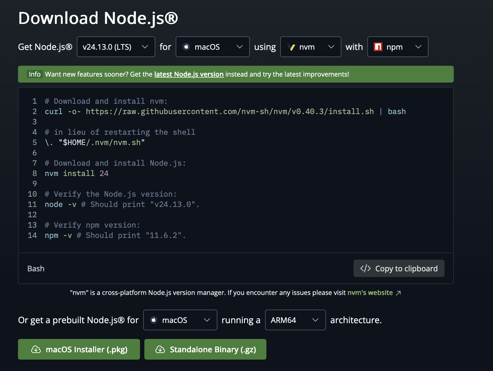
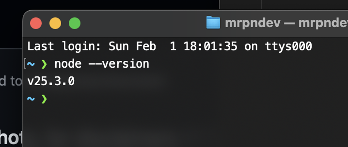

## Welcome

Let's have a smooth start to our journey. We will be using a multitude of tools in our cohort. Installing them prior to start of the session helps us hit the ground running.

### Node.js

Node is a runtime environment. JavaScript only runs in the browser, so in order for it to run on our computer, we need a runtime -- Node.js serves this purpose.

Download it from [Node.js site](https://nodejs.org/en)
- [ ] select 'Get Node'
- [ ] it will auto select the version and the operating system.
- [ ] download it and follow the prompts

In order to check if Node is installed correctly

- [ ] Open your terminal
	- [ ] macOS Users: hit cmd + spacebar, and type `terminal`, then hit enter
	- [ ] Windows Users: select start, search, and type `powershell`, then hit enter
- [ ] type `node --version`

If it displays with a version, you successfully installed Node.js

### GitHub

GitHub is a cloud service we use for collaboration, version control, deployments, and in our case, to backup our code.

Go to [GitHub's site](https://github.com) and create an account. We will also need to link our Git with GitHub, but we will do that later. If you're up for a challenge, I will provide you with links to instructions at the end of this document.

### Git

Git is the most common version control system. Think of it like a time machine but for your code. First, let's see if you already have it installed.

- [ ] Open your terminal
	- [ ] macOS Users: hit cmd + spacebar, and type `terminal`, then hit enter
	- [ ] Windows Users: select start, search, and type `powershell`, then hit enter
- [ ] type `git --version`

If you see a response, it means you have git and can skip the rest of the instructions.

- [ ] Go to [Git's site](https://git-scm.com)
- [ ] Click `Install`
- [ ] **Windows Users** during the installation, you will be asked to download `GitBash`. Make sure that option is selected

Once finished, repeat the instructions to check for git version.

### GitHub Desktop

We will not be using this app, but installing and running it can setup our SSH keys between git and GitHub. This greatly reduces painstaking setup of SSH keys.

- [ ] Go to [GitHub Desktop site](https://desktop.github.com/download/) and download it
- [ ] Install it by following the prompts
- [ ] Ensure you login to your GitHub account using it

### Visual Studio Code

VSCode will be our integrated development environment (IDE) of choice. We will use it to write and run our code. It is lightweight, easy to use, and incredibly extensible. While you may use your IDE of choice, I will only support questions about VSCode and therefore highly recommend you use it.

- [ ] Go to [VSCode's site](https://code.visualstudio.com) and follow the prompts to download it
- [ ] If at any point during the installation you are asked to add `code` to your `$PATH`, make sure you select it

### Postgres (optional for now)

PostgreSQL is a flavor of a SQL database that's easy to use. While we won't be using Postgres for a while, it's a good idea to get all of the installations out of the way.
 - [ ] Go to [Postgres' site](https://www.postgresql.org) and follow the prompts to download it
 - [ ] Install Postgres with all of its presets
 - [ ] **WARNING** Postgres may ask you to create username and password. They are localhost credentials and do not have to be secure.
 - [ ]  **DO NOT FORGET** those credentials. They will be required to connect to the Postgres server in the future. Please keep them in a safe place.

### SSH Key Setup

In order to push our local code to GitHub, we need to establish connection. GitHub abandoned this setup using username and password a long time ago in the name of security. Now, the only way requires setting up SSH keys.

If you installed GitHub Desktop and followed the prompts, there's a good chance you will not need to perform the steps required here. If you're on **Linux** or if GitHub Desktop does not work, below are the steps required to create SSH key pair and adding it to GitHub.

[SSH Key Generation](https://docs.github.com/en/authentication/connecting-to-github-with-ssh/generating-a-new-ssh-key-and-adding-it-to-the-ssh-agent)

[Adding SSH key to GitHub](https://docs.github.com/en/authentication/connecting-to-github-with-ssh/adding-a-new-ssh-key-to-your-github-account)

